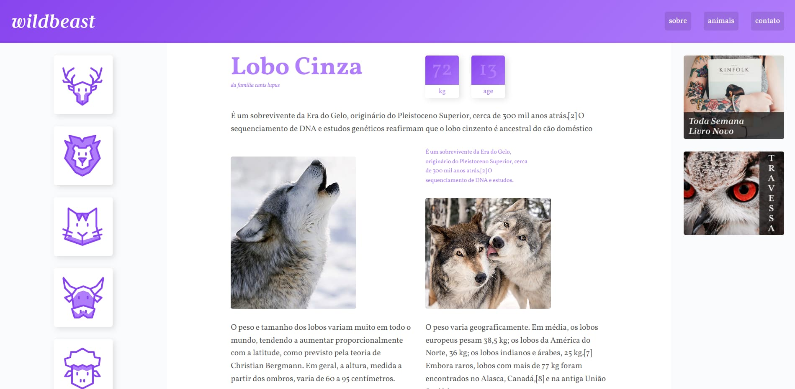

# 🐺 Wildbeast

Bem-vindo ao projeto Wildbeast, desenvolvido como parte do curso de CSS Grid layout da [Origamid](https://www.origamid.com/). O objetivo é criar um site utilizando apenas HTML e CSS para treinar o uso do Grid layout.

